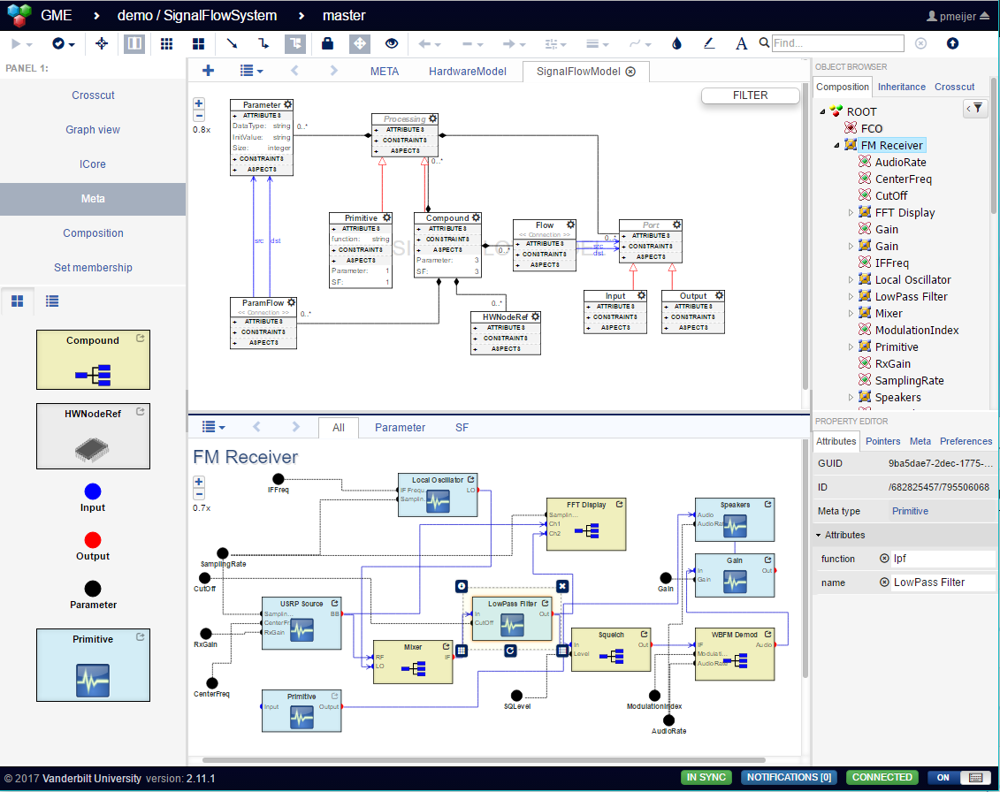

[](https://opensource.org/licenses/MIT)
[](https://travis-ci.org/webgme/webgme)
[](https://www.npmjs.com/package/webgme)
[](http://img.shields.io/npm/dm/webgme.svg?style=flat)

# WebGME - Web-based Generic Modeling Environment

Note that this repository contains the full webgme app including a highly extendable graphical user interface and is the typical dependency a webgme app will depend on.
To use the webgme framework without a packaged GUI - check out [webgme-engine](https://github.com/webgme/webgme-engine).

Create your own Domain Specific Modeling Languages (DSML) right in the browser. Specify modeling concepts, their relationships, attributes, and aspects by drawing a UML class diagram-based metamodel and WebGME automatically configures itself to support the DSML.

WebGME promotes collaboration where each change is translated into a micro-commit broadcast to all connected users. A lightweight branching scheme is transparently supported by the infrastructure. Code generators and externals tools can work on consistent snapshots (specific commits) while users can continue editing the models.

WebGME provides a variety of extension points for you to customize your application. See below for a list and explainations. All these can be neatly generated, shared and imported using a [command line interface](https://github.com/webgme/webgme-cli).



# Getting started

### Dependencies
#### Server
 - [NodeJS](https://nodejs.org/) (version >= 4, CI tests are performed on versions 8.x, 10.x and LTS is recommended).
 - [MongoDB](https://www.mongodb.com/) (2.6 <= version <= 4.x).
 - [Git](https://git-scm.com) (must be available in PATH).
 - [Redis](https://redis.io/) Note that this is only needed if you intend on running [multiple webgme nodes](https://github.com/webgme/webgme/wiki/Multiple-Nodes) behind a reverse proxy.

#### Browser
We aim to support all the major modern browsers. However we recommend using Chrome for two reasons: manual testing is mostly done using chrome and all performance profiling is done against the [V8 JavaScript Engine](https://en.wikipedia.org/wiki/V8_(JavaScript_engine)).

#### Tutorials
- [Step by step tutorial](https://webgme.readthedocs.io/) - Explains meta-modeling in webgme and builds up a small application for Electrical Circuits.
- [Tutorial from seminar 2015](https://github.com/webgme/tutorials) - Shows development techniques in webgme and builds up a Finite State Machine domain. This tutorial requires familiarity with meta-modeling. 

### Using WebGME
You can always try out webgme at our public deployment at [webgme.org](https://webgme.org). After a certain point you probably want to host your own server with custom running code and visualization. At this point follow the instructions at 1.

1. [webgme-cli](https://github.com/webgme/webgme-cli). This is the preferred way of using webgme as it allows you to:
 * Automatically generate boilerplate code for [extensions](#extensions) (w/o manually configuring paths etc.).
 * Reuse components from other users.
 * Publish and share your work with others.
 * Updating to newer webgme releases only requires a `npm install webgme` and won't cause any conflicts.
 * **Note that** if cloning an existing repository constructed with webgme-cli, it is only necessary to install webgme-cli if you intend to create/import new components.

2. For webgme developers, clone this repo.
 * install packages with npm `npm install`
 * launch mongod locally, e.g.
```
docker run --name my-mongo -d -p 27017:27017 mongo:4.4
```
 
 * start the server `npm start`

After the webgme server is up and there are no error messages in the console. Open a valid webgme address in the browser. The default is `http://127.0.0.1:8888/`, you should see all valid addresses in the console where you started webgme.
To view the available documentation visit `<host>/api`.

# Command line interface

The webgme-engine provides a range of bin scripts, [see here for list of all](https://github.com/webgme/webgme-engine#command-line-interface).

# Extensions
* [Plugins](https://github.com/webgme/webgme/wiki/GME-Plugins) - Model interpretation for e.g. code generation.
* [Executor](https://github.com/webgme/webgme/wiki/GME-Executor-Framework) - Job execution framework over multiple worker nodes.
* [Rest Routers](https://github.com/webgme/webgme/wiki/REST-Routers) - Add custom REST API routes with access to gme-auth and storage APIs.
* [Constraints](https://github.com/webgme/webgme/wiki/GME-Constraints) - Add custom constraints based on meta-types.
* [AddOns](https://github.com/webgme/webgme/wiki/GME-Add-Ons) - Continuous model interpretation for e.g. constraint evaluation.
* [Webhooks](https://github.com/webgme/webgme/wiki/GME-WebHooks) - External event emitting based on changes in storage/models.
* [Layouts](./src/client/js/Layouts/DefaultLayout) - Configure the layout of the generic UI.
* [Visualizers](https://github.com/webgme/webgme/wiki/GME-Visualizers) - Add complete visualizers to the generic UI.
* [Decorators](https://github.com/webgme/webgme/wiki/GME-Decorators) - Add custom decoration to the nodes in the model editor.

See [gme-config](./config/README.md) for available configuration parameters.

# Change log
See [CHANGELOG](./CHANGELOG.md)

# Contributing
See [CONTRIBUTING](./CONTRIBUTING.md)

# License
See the [LICENSE](LICENSE) file.
