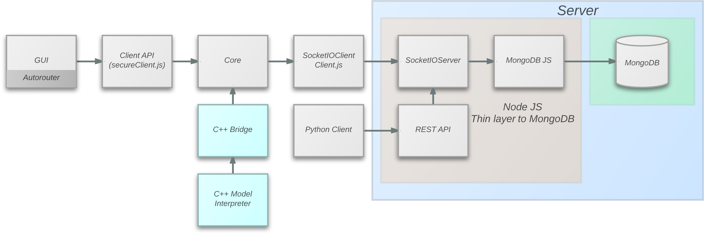

.. webgme node.js to C++ bridge documentation master file, created by
   sphinx-quickstart on Tue Dec 10 15:24:00 2013.
   You can adapt this file completely to your liking, but it should at least
   contain the root `toctree` directive.

Introduction
=============

WebGME is written in JavaScript and its core functionality resides on the client side (i.e., the web browser). The only
server side component of the system is the model database. At this stage of development, model interpreters for WegGME
can only be written in JavaScript. However, in order to support current users of GME who use C++ and other language
bindings to write model interpreters, the core functionality of WebGME needs to be made available in their respective
languages.

    A basic architecture of WebGME

This project provides a way to bridge WebGME's JavaScript code to C++. This is accomplished by using NodeJS to run
WebGME's JavaScript code and use NodeJS' C++ addon feature. The C++ addon feature allows JavaScript objects running in
NodeJS to be accessed and manipulated from C++. This allows us to expose an API to WebGME's JavaScript objects. Using
the proposed bridge, users can write model interpreters in C++ and link their code to a static NodeJS library.

.. toctree::
    :maxdepth: 2

    interpreter
    api

Indices and tables
==================

* :ref:`genindex`
* :ref:`modindex`
* :ref:`search`

