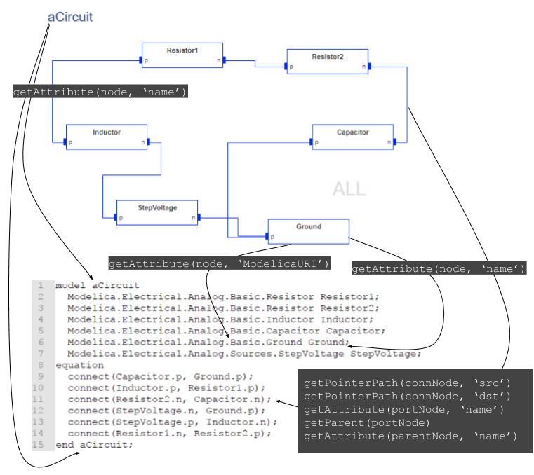

Creating the Code Generator
=========================
So far we have constructed a meta-model for our electrical-circuit domain. It enabled us to create models that resembles
circuits. Up to this point though there is no actual meaning to the circuits. As humans we can infer certain properties from
these circuits, but the models themselves don't impose any particular interpretation. The meta-model infers the structural semantics,
but no behavioural semantics.

There are many potential interpretations and interpreters of our circuit models. In this tutorial we will focus on generating
Modelica code that can be used to simulate the dynamic behavior of the circuit in question.

How to Implement the Interpreter?
-----------------------
In webgme the typical extension point for writing interpreters are plugins. The plugin framework and API are designed to
enable both server- and browser-side execution of the same code. At the point where a plugin is executed it will have
access to the context it was invoked and through various webgme APIs; :code:`Core`, :code:`Project`, :code:`BlobClient` etc.

In this tutorial we will create two plugins;

* *ModelicaCodeGenerator* - traverse model and extract the data needed to generate a Modelica model corresponding to the
 circuit being interpreted. This plugin will also generate the Modelica code.
* *SimulateModelica* - this plugin will invoke the *ModelicaCodeGenerator* to retrieve the Modelica code and implement
the logic needed to invoke a Modelica tool (OpenModelica in this case) at the generated output. This plugin will also be
responsible for communicating back the simulation result to the end-user.

There a couple of reasons why this is a favourable division. To generate the Modelica code there is no restrictions on
where the plugin is executed. The server does not have to have any 3rd party dependencies installed (alternatively connected
workers with these installed) and the plugin can even run in the browser. For some deployments restricting the set of features
to only generate the Modelica code might be favorable. When it comes to writing tests it is typically easier to divide
functionality into separate implementations.

We will start with the *ModelicaCodeGenerator* here and continue with the *SimulateModelica* in the analysis tool section...

Generating a Plugin Template
-----------------------
To get a quick start we use the webgme-cli tool in order to create a new plugin. Navigate to the root of the repository
created in earlier sections and invoke the command below.

.. code-block:: bash

    webgme new plugin ModelicaCodeGenerator

This should generate a range of new files..

:code:`src/plugins/ModelicaCodeGenerator/metadata.json`
    This json-structure contains information about the plugin and is used by the GUI and plugin-framework. Details
    about what goes in here is explained in the `wikipages <https://github.com/webgme/webgme/wiki/GME-Plugins#metadatajson>`_.

:code:`src/plugins/ModelicaCodeGenerator/ModelicaCodeGenerator.js`
    This is the code of the plugin itself. The very first lines shows the dependencies needed for this code
    to run and is using `requirejs <http://requirejs.org/>`_ hence the syntax
    :code:`define(['path'], function (Module){ ... return ModelicaCodeGenerator;});`. The last return statement is the
    module that this file defines when required by another module (the plugin framework must be able to load our plugin).

:code:`test/plugins/ModelicaCodeGenerator/ModelicaCodeGenerator.spec.js`
    This is the outline of a `mocha <https://mochajs.org/>`_ test suite for the plugin and shows how to build up a test
    context and invoke a plugin from a unit-test.

You might also have noted that the :code:`config/config.webgme.js` was modified. In order for the webgme plugin framework
to find our plugin the path to it is added to the configuration file. Note that both :code:`config.default.js` and
:code:`config.test.js` load and reuse the added configuration parameters from this file.

The video below shows how to generate the new plugin and modify it so we have a map of all the nodes from the `activeNode`.
The `activeNode` is the invocation point of a plugin and in the next sub-section we will register our plugin at `Circuits`.

.. raw:: html

    

        <iframe width="560" height="315" src="https://www.youtube.com/embed/SddGyiYtJ34" frameborder="0" allowfullscreen></iframe>
    

|

Registering the Plugin at Circuits
----------------------
The generated plugin is available from the browser and the server, however in order to present it to the user on the GUI,
we must register it at the appropriate nodes. In our case we want the code-generator to be invoked on node of meta-type
`Circuit` so we edit the value at the meta-node and the registered value will propagate down the inheritance chain.

This video shows how we register the plugin and how we can enable the gme-logger for the *ModelicaCodeGenerator* in the browser.
(Note that after updating the localStorage the page must be refreshed. The page must also be refreshed each time we update
the plugin code on the server.)

.. raw:: html

    

        <iframe width="560" height="315" src="https://www.youtube.com/embed/SddGyiYtJ34" frameborder="0" allowfullscreen></iframe>
    

|

Querying the Model
--------------------------
At this point we have the context setup up for our plugin. The activeNode for the plugin will be a ``Circuit`` and all
nodes in the sub-tree are pre-loaded in a map, where keys are the path (a unique id) to the nodes and values are the
node objects.

To extract data from the model we will be using the `Core-API <https://github.com/webgme/webgme/wiki/GME-Core-API#using-the-api>`_,
and it's highly recommended to read the section on how to use the API.

Before we start extracting the necessary data from the model we need to pin down what we need from our models in order
to, in this case, generate Modelica code. The figure below shows the mapping from the ``Circuit`` to Modelica code and
the related Core-API calls. (For simplicity we will leave out the Modelica parameters and use the default value from **MSL**.)

    Mapping from a ``Circuit`` in our webgme model to Modelica code

We will break up the task into two parts; 1) Extracting the data and 2) Generating the modelica code. The high-level
outline of the first part is shown below in the code block where all the extracted data will be stored in serializable
JavaScript object.

.. code-block::
    ExtractName(activeNode)
    for all (Node child in activeNode) do
        if (child.metaType is Component) then
            ExtractNameAndModelicaURI(child)
        else if (child.metaType is Connection) then
            [srcNode, dstNode] = GetConnectedNodes(child)
            srcParent = GetParentNode(srcNode)
            dstParent = GetParentNode(dstNode)
            ExtractNames([srcNode, dstNode, srcParent, dstParent])
        end if
    end for

Now let's see what the actual code could look like...

TODO: Video

Implementing the Code Generation
--------------------------
At this point we have the context setup up for our plugin.

Storing the generated file
-----------------------------
TODO