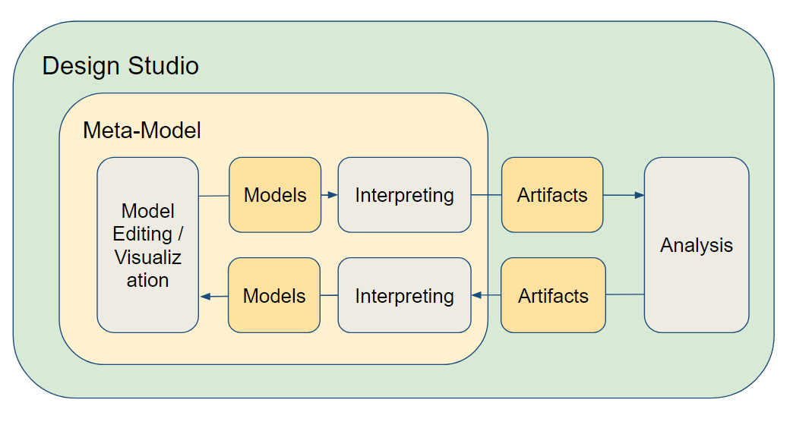

Design Studio
======================
A framework with a set of tools and services for simplifying one or many (typically engineering) tasks.

Typical components of a design studio include:

* A domain (meta-model) for building models
* Model interpreters typically targeting analysis tools
* Interfaces/services towards (third party) analysis tools
* A GUI/Visualization for modeling and viewing analysis results
* Version controlled models and centralized storage

    Overview of a Design Studio

Example Design Studios
--------------------

`DeepForge <http://deepforge.org>`_
  DeepForge is an open-source visual development environment for deep learning providing end-to-end support for creating
  deep learning models. This is achieved through providing the ability to design architectures, create training pipelines,
  and then execute these pipelines over a cluster. Using a notebook-esque api, users can get real-time feedback about the
  status of any of their executions including compare them side-by-side in real-time.

`ROSMOD <https://github.com/rosmod/webgme-rosmod>`_
  The Robot Operating System Model-driven development tool suite, (ROSMOD) an integrated development environment for rapid prototyping component-based software for the Robot Operating System (ROS) middleware. ROSMOD consists of:
  1) The ROSMOD Server, which provides collaborative model-driven development, and 2) The ROSMOD Comm layer, which extends ROS to provide a more well defined component execution model with support for prioritization of component event triggers.

`BIP <https://github.com/anmavrid/webgme-bip>`_
  BIP is a framework for the component-based design and analysis of software systems. It has been successfully used for modelling
  and analysis of a variety of case studies and applications, such as performance evaluation, modeling and analysis of TinyOS-based
  wireless sensor network applications, construction and verification of a robotic system. In the latter, the code generated by the
  tool-chain along with the BIP engine is used as a controller for the robot. The BIP framework also offers validation techniques for
  checking essential safety properties.

