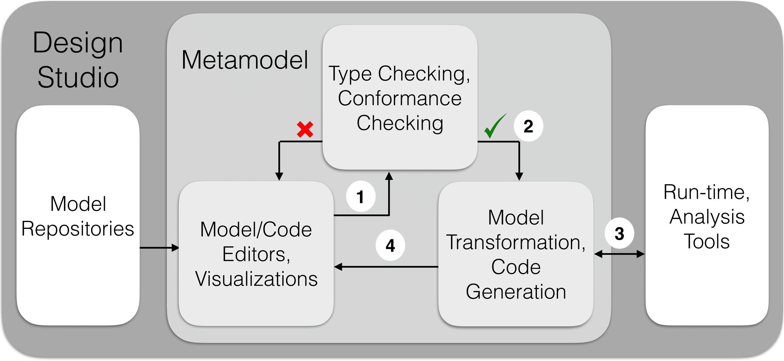

What is a Design Studio?
======================
A framework with a set of tools and services for simplifying one or many (typically engineering) tasks.
Design studio components can be organized in the following three categories: 1) semantic integration, 2) service integration, and 3) tool integration.

Semantic integration
    Semantic integration components comprise the domain of the modeling language, i.e., its metamodel that explicitly specifies the building blocks of the language and their relations.

Service integration
    Service integration components include dedicated model editors, code editors, and GUI/Visualization components for modeling and simulating results.
    Additionally, service integration components include model transformation and code generation services, consistency
    and type checking mechanisms, model repositories, dedicated model interpreters, and version control services.

Tool integration
    Tool integration components consist in interfaces and integration services towards third party tools such as run-times and verification tools.

The following figure shows the main steps of the design flow. Initially, models are designed using dedicated model editors.
Optionally, design patterns stored in model repositories can be used to simplify the modeling process. Next, the checking loop starts (step 1),
where the models are checked for conformance, optionally by using dedicated tools. If the required conformance conditions are not satisfied by the model,
the checking mechanism must point back to the problematic nodes of the model in the model editor and inform the developer of the inconsistency
causes to facilitate model refinement. Finally, when the conformance conditions are satisfied (step 2),
the refined models can be analyzed (e.g. for safety properties) and/or executed (step 3) by using integrated, into the design studio, third party tools.
The output of the tools is then collected and sent back to the model editors (step 4) for visualization of analysis or execution results.

    Overview of a Design Studio

Example Design Studios
--------------------

`DeepForge <http://deepforge.org>`_
  DeepForge is an open-source visual development environment for deep learning providing end-to-end support for creating
  deep learning models. This is achieved through providing the ability to design architectures, create training pipelines,
  and then execute these pipelines over a cluster. Using a notebook-esque api, users can get real-time feedback about the
  status of any of their executions including compare them side-by-side in real-time.

`DesignBIP <https://github.com/anmavrid/webgme-bip>`_
    DesignBIP is an all-in-one, web-based, collaborative, modeling and execution environment for building concurrent systems using the BIP (Behavior-Interaction-Priority) component framework. DesignBIP allows specifying BIP interaction and behavior models in a graphical way and generating the equivalent code. DesignBIP provides model repositories, design guidance services, code generators and integration with the BIP tool-set.

`ROSMOD <https://github.com/rosmod/webgme-rosmod>`_
  The Robot Operating System Model-driven development tool suite, (ROSMOD) an integrated development environment for rapid prototyping component-based software for the Robot Operating System (ROS) middleware. ROSMOD consists of:
  1) The ROSMOD Server, which provides collaborative model-driven development, and 2) The ROSMOD Comm layer, which extends ROS to provide a more well defined component execution model with support for prioritization of component event triggers.

