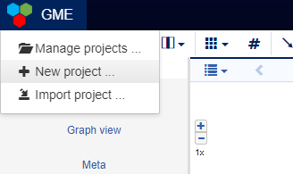
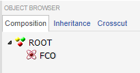

Creating a Webgme Project
======================
Alright, looks like you have all the dependencies set up and your own webgme server running!

In order to get familiar with how modeling is done in webgme and what the different panels do, you need to create a project.
If this is the first time you visit your deployment and there currently aren't any projects available, you should see a modal window titled :code:`Projects`.

.. figure:: new_project.png
    :align: center
    :scale: 65 %

    Manage project dialog

In case you happened to have closed it or it doesn't show up for any other reason you can bring it up from the **Project Navigator**, by hovering the GME icon
and clicking :code:`Manage projects ...` (to save a click you can also click :code:`New project ...` right away.)

    Main menu in **Project Navigator**

Select a suiting name for you project, why not :code:`ElectricalCircuits`, and proceed with the instructions. You should create a project from a seed and select
the :code:`EmptyProject` from one of the Template Files.

After this step you should have an "empty" project containing only the **FCO** and the **ROOT** node. Every webgme project contain these and they cannot be removed.
(Looking back at the `terminology <getting_started/terminology.rst>`_ page you'll see that these are the roots of the inheritance and containment trees respectively, and since both
of these are **strong** relationships, the removal of any of these would remove all other nodes).

    The **Composition** tab in the **Object Browser** shows all the nodes in our project-tree.

.. raw:: html

    

        <iframe width="560" height="315" src="https://www.youtube.com/embed/xR0rmcVFcgY?rel=0" frameborder="0" allowfullscreen></iframe>
    

Note that authentication is currently not turned on your deployment and every user will be identified as the :code:`guest`.