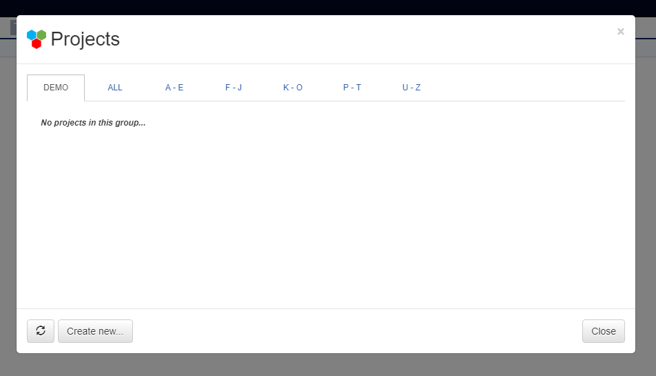

Creating a Webgme Project
======================
Alright, looks like you have all the dependencies set up and your own webgme server running!

In order to get familiar with how modeling is done in webgme and what the different panels do, you need to create a project.
If this is the first time you visit your deployment and there currently aren't any projects available, you should see a modal window as depicted below.

        Manage project dialog

In case you happened to have closed it or it doesn't show up for any other reason you can bring it up from the Project Navigator, by hovering the GME icon
and clicking the :code:`Manage projects ...` (to save a click you can click :code:`New project ...` right away.)

.. figure:: new_project1.png
    :align: center
    :scale: 65 %

            Projects menu in Project Navigator

Select a suiting name for you project, why not :code:`ElectricalCircuits`, and proceed with the instructions. You should create a project from a seed and select
the :code:`EmptyProject` from one of the Template Files.

This `video <https://youtu.be/xR0rmcVFcgY>`_ explains more detail how you can create and manage projects webgme. Note that authentication is currently not turned on
your deployment and every user will be identified as the :code:`guest`.