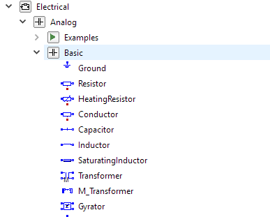
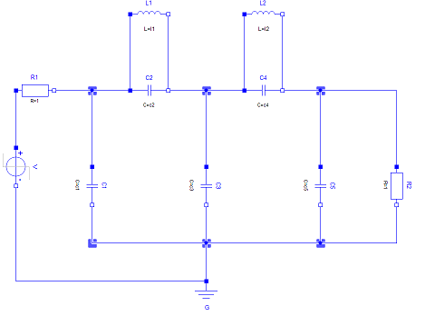

.. _creating-the-meta-model:
Creating the Meta-model
======================
At this point you should have a basic understanding of the concepts of meta-modeling in webgme. Before starting to build
a meta-model for our electrical circuit domain, you need to know the basics behind the webgme GUI...

.. raw:: html

    

        <iframe width="560" height="315" src="https://www.youtube.com/embed/SddGyiYtJ34" frameborder="0" allowfullscreen></iframe>
    

Which concepts do we need?
--------------------------
The first thing to layout when constructing a meta-model is what type of concepts do we need? Which these are does not only
depend on the domain, but also the analysis tools being targeted. Since our target is **Modelica** and more specifically the
Basic Components in the Analog Electrical library as part of the **Modelica Standard Library**, we should take that into consideration.

        Electrical Analog components in Modelica

This library contains a range of electrical components with a various number of pins. Looking at one of the examples we
see that the pins are connected via electrical connections.

    A Cauer Low Pass Analog Circuit in Modelica

With or without Modelica a very natural breakdown of this domain is include the concepts of a :code:`Component`, :code:`Pin`, and :code:`Connection`.
Additionally, since our goal is to build electrical circuits, we also need the concept of a :code:`Circuit`.
Later we will add sub-types of components corresponding to components such as ``Resistor``, ``Ground``, ``Capacitor``, ``Inductor``, etc.

The video below shows how you can add these initial concepts as meta-nodes starting from your empty project.

.. raw:: html

    

        <iframe width="560" height="315" src="https://www.youtube.com/embed/LbwlUVcgvBk" frameborder="0" allowfullscreen></iframe>
    

|

Containment
----------------
Now let's model where these concepts can be added in the containment-hierarchy.

A ``Circuit`` should be able to contain ``Components`` wired together by ``Connections``. The way connections
are constructed in webgme requires us to add a containment rule for the ``Connection`` w.r.t. the ``Circuit``.
Next section illustrates how we can make the ``Connection`` in to an actual connection (an edge on the drawing canvas).

Inside the ``Component`` the ``Pins`` determine where the ``Connections`` connect the ``Components`` together.

The video below shows how to add these containment rules to our meta-model using the Meta Editor.

.. raw:: html

    

        <iframe width="560" height="315" src="https://www.youtube.com/embed/LbwlUVcgvBk" frameborder="0" allowfullscreen></iframe>
    

|

Sub-types of Components
--------------------
So far our meta-model only contains a generic ``Component`` for representing electrical components, but we need a way to represent
specific electrical components such as ``Resistor``, ``Ground``, etc. There are multiple ways we can achieve this by extending the
meta-model. Since our domain is relatively small we will take the approach of adding a meta-type for each type of electrical component
and add the related Modelica parameters as attributes.

An alternatively approach would be to create the different types of electrical components outside of the meta and treat
the Modelica parameters as separate child nodes of the components. This approach allows for creation of new types
without modifying the meta-model itself, but also makes the modeling a bit more cumbersome using the default visualization.
(Visualizing and modifying the parameters of a component could no longer be done from a single node.)

For the sake of simplicity we will take the first approach and limit out domain to the five components (we will also leave out
the heat portion of the components). Note that the associated Modelica parameters can be extracted from the **Modelica Standard
Library** using a Modelica tool, such as `OpenModelica <https://openmodelica.org/>`_. For each component we need to indicate
its unique path or identifier within the **MSL**, this will be captured by the read-only attribute ModelicaURI. In order to
map directly to Modelica we name the ports the same way they're named in **MSL**.

Resistor
    Attributes
        - ``ModelicaURI`` - ``Modelica.Electrical.Analog.Basic.Resistor``
        - ``R`` - The resistance of the resistor in Ohm. A float greater or equal to ``0`` with a default value of ``1``.
    Ports
        Two ``Pins``, ``p`` and ``n``.

Ground
    Modelica requires each electrical system (``Circuit`` in our case) to contain a ground component in order to make the system solvable.

    Attributes
        - ``ModelicaURI`` - ``Modelica.Electrical.Analog.Basic.Ground``
    Ports
        One ``Pin``, named `p`.

Inductor
    Attributes
        - ``ModelicaURI`` - ``Modelica.Electrical.Analog.Basic.Inductor``
        - ``L`` - The inductance of the inductor in Henry. A float greater or equal to ``0`` with a default value of ``1``.
    Ports
        Two ``Pins``, ``p`` and ``n``.

Capacitor
    Attributes
        - ``ModelicaURI`` - ``Modelica.Electrical.Analog.Basic.Capacitor``
        - ``C`` - The capacitance of the capacitor in Farad. A float greater or equal to ``0`` with a default value of ``1``.
    Ports
        Two ``Pins``, ``p`` and ``n``.

StepVoltage
    Attributes
        * ``ModelicaURI`` - ``Modelica.Electrical.Analog.Sources.StepVoltage``
        * ``V`` - The voltage of the source in Volt. A float with a default value of ``1``.
        * ``startTime`` - Time offset (when the voltage goes from 0 to ``V``) in seconds. A float with a default value of ``1``.
    Ports
        Two ``Pins`` ``p`` and ``n``.

With the approach taken the ``Component`` meta-type itself does not have any interpretation w.r.t. our domain and will only
act as an `abstract` type that cannot be instantiated. In addition to the ``Component`` it's also convenient to introduce
an additional `abstract` base type that defines two ``Pins``, ``p`` and ``n``, and let all ``Components`` but the ``Ground``
be derived from it. In general this approach is not only more elegant and convenient, but also more efficient since the raw data
for the two pins can be shared and requires less data to be loaded from the server. Therefor we will introduce the ``TwoPinComponent``
meta-type as well.

The video below shows how to create the new types with attributes and pins as defined above.

TODO: Video

Connections and Ports
--------------------
In order to create connections between ``Components`` or rather between the ``Pins`` of the ``Components`` we need to
make our ``Connection`` into a connection like object. In webgme's meta-model there is no first order concept of a connection,
instead such can be constructed using reserved named pointers; ``src`` and ``dst``. The target of each will be the source and
destination of the ``Connection`` respectively. For more details on connections revisit the `"Connections" meta_modeling_concepts.html#connections>`_
under `"Meta-modeling Concepts" meta_modeling_concepts.html`_.

Just like with connections, there is no first order concept of a port in webgme. Connection sources and destinations are
only constrained by the valid pointer ends defined in meta-model and can crosscut over the containment hierarchy. To make
modeling more comprehensible, it is often useful to be able to visually propagate port like children up to boundary of
the parent node. The way this is solved in webgme is through the `meta-property meta_modeling_concepts.html#meta-property>`_ (implemented as registry) `isPort`.
Note that the usage of this property only takes effect if the decorator (the UI component responsible for drawing the box
on the canvas) implements logic using this property - this is the case for both the default Model- and SVG-Decorators.

TODO: Video