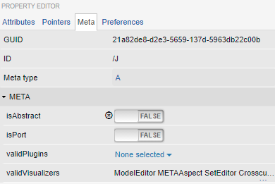

Meta-modeling Concepts
======================
The meta-meta-model in webgme describes the syntax for the meta-models. Below follows a short description and a video
elaborating on each concept defined in the meta-meta-model. To follow this tutorial it is perfectly fine to skip
**Sets**, **Mixins**, **Aspects** and **Constraints**. This whole section can also be seen as a reference manual and it's
recommended to return to these during the section :ref:`creating-the-meta-model`.

Containment
-------------

* Defines where in the containment hierarchy a node can be created
* One-to-many relationship

    - The cardinality can be restricted (e.g 0..* means any number of children)

* All nodes have a parent

    - Except the ROOT node which is the root of the Composition Tree

* Containment is a strong relationship: if a parent node is deleted so are all its children

.. raw:: html

    

        <iframe width="560" height="315" src="https://www.youtube.com/embed/kVLq32SoFM4?rel=0" frameborder="0" allowfullscreen></iframe>
    

|
|

Base Relationship/Inheritance
--------------------

* The base is a built-in pointer (one-to-one relationship)
* All nodes have base pointer defined
* All nodes (except the ROOT and FCO) have another node as their base

    - The FCO is the root of the Inheritance Tree (the ROOT lives outside!)

* We can modify the value of base in the Meta Editor
* The base/instance relationship is a strong relationship: if a base node is deleted so are all its instances
* A node’s base is its prototype

    - Prototypal/Prototypical inheritance: asking for a property of a node traverses the base-chain till a value is reached

.. raw:: html

    

        <iframe width="560" height="315" src="https://www.youtube.com/embed/vMTveKozhY0?rel=0" frameborder="0" allowfullscreen></iframe>
    

|
|

Attributes
----------------------

* Textual or numerical information
* Types: string, boolean, integer, float and asset

    - Assets can store a SHA-256 hash acting as an identifier for an artifact stored outside the model database

* name is by default defined on the FCO

    - Is used to identify meta-nodes

* Depending on the type, attributes can have different properties:

    - Default value - the value stored at the node defining the attribute
    - Read-only - the value can only be edited at meta-nodes
    - Enumeration, min, max, regex, multiline, etc.

.. raw:: html

    

        <iframe width="560" height="315" src="https://www.youtube.com/embed/8098zuY2Snk?rel=0" frameborder="0" allowfullscreen></iframe>
    

|
|

Pointers
-------------

* Named one-to-one relation between two nodes, the owner and the target
* Target of a pointer is either another node or NULL
* base is a built-in pointer (inheritance)

.. raw:: html

    

        <iframe width="560" height="315" src="https://www.youtube.com/embed/EvpSbCxcYSs?rel=0" frameborder="0" allowfullscreen></iframe>
    

|
|

Connections
---------------

* Not an actual concept of meta-meta-model
* Using reserved named pointers, src and dst, we can create connections
* Connections are a visualization technique on the canvas for nodes with pointers src and dst defined
* We can assign attributes, children etc. to a connection and we can create any number of connections from/to a node
* In the Property Editor we can see that it’s just two pointers
* If any of the src or dst pointers are NULL, the connection appears as a regular box annotated with << Connection >>

.. raw:: html

    

        <iframe width="560" height="315" src="https://www.youtube.com/embed/0xYusMMBt1I?rel=0" frameborder="0" allowfullscreen></iframe>
    

|
|

Sets
--------------

* One-to-many relationship between a set owner and members
* The cardinality can be restricted (e.g 0..* means any number of members)
* Has special visualizer: Set membership

    - Similar to Composition - but members are visualized/edited

* Meta-nodes are the members of the built-in set, MetaAspectSet, owned by the ROOT

.. raw:: html

    

        <iframe width="560" height="315" src="https://www.youtube.com/embed/w5XwVu3ZQ0E?rel=0" frameborder="0" allowfullscreen></iframe>
    

|
|

Mixins
------------

* Meta-nodes can be used by other meta-nodes as mixins
* Meta-definitions are inherited from mixins

    - No actual data (e.g. attr values) of the mixin node is inherited

* A meta-node can have more than one mixin (but only one base)

    - In case of colliding definitions, the base node has precedence
    - Collisions among mixins resolved based on GUID

.. raw:: html

    

        <iframe width="560" height="315" src="https://www.youtube.com/embed/Fd6lbKdfYXY?rel=0" frameborder="0" allowfullscreen></iframe>
    

|
|

Aspects
------------

* Defines filtered views of your composition/containment (by selecting a set of valid children types)
* Defined aspects show up as tabs in the Composition view

.. raw:: html

    

        <iframe width="560" height="315" src="https://www.youtube.com/embed/JQXFCUnlwyI?rel=0" frameborder="0" allowfullscreen></iframe>
    

|
|

Constraints
------------

* Functions defining constraints that cannot be captured by other meta-rules
* Such custom constraints are evaluated at the server and by default turned off

    - To enable :code:`config.core.enableCustomConstraints = true;`

* Constraints will be evaluated for every node that is of the meta-type where

.. raw:: html

    

        <iframe width="560" height="315" src="https://www.youtube.com/embed/KZZ2LGp2WLY?rel=0" frameborder="0" allowfullscreen></iframe>
    

|
|

Meta Properties
------------------
Meta properties are properties that are typically set on meta-nodes with main purpose to guide/constrain the end-user while modeling.
In contrast to the other concepts they are not defined using the Meta Editor, instead they are set in META tab in the Property Editor.

        The META-tab in the Property Editor.

isAbstract
    An abstract node cannot be instantiated or copied

isPort
    A port node will visually be elevated to the border of its parent.

validPlugins
    A list of plugins that can accepts the node as active-node.

validVisualizers
    Which visualizers should be listed for the node and which one should be opened when navigating to it.