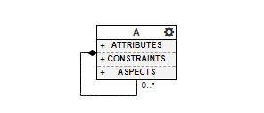

Meta-modeling in Webgme
======================
OK, so in webgme you can make a (meta-)model that describes how models can be composed. That's all sounds pretty neat, but
in order for that to work in practise some more concepts are needed.

* How do nodes (model elements) relate to each other in general, what are the restrictions?

Webgme Data-model
------------------
Leaving the adaptive UI on the side, it is completely possible to construct models using webgme's APIs that do not adhere
to any specific meta-model. Below are the built-in concepts of the webgme data-model listed. Note that they are tightly coupled
with concepts of the meta-models.

**FCO**
    “first class object”, “object”, “thing” every node is derived from this (except the **ROOT**)
Inheritance
    Single tree rooted at the **FCO**. Every node has a base, except the **FCO** and **ROOT**. Inheritance is a strong
    relationship: If the base is removed so are all derived nodes. Webgme uses `prototypal inheritance <https://en.wikipedia.org/wiki/Prototype-based_programming>`_.
Containment
    Single tree rooted at **ROOT**. Every node has a parent except the **ROOT**. Inheritance is a strong relationship:
    If the parent is removed so are all children nodes.
Pointer
    A one-to-one named association. The equivalent in UML is `Directed Association <https://en.wikipedia.org/wiki/Association_(object-oriented_programming)>`_.
Set
    A one-to-many named association. Similar to pointers but the owner can associate with more than one target. Also similar to containment by it is not a strong relationship.
    The equivalent in UML is `Aggregation <https://en.wikipedia.org/wiki/Object_composition#Aggregation>`_. In webgme sets can store data about their members.
Attribute/Registry
    Textual or numerical information stored at the nodes. Attributes adhere to the meta-model, whereas registries can hold any type
    data without meta-violations.

The Meta-meta-model
--------------------
The meta-meta-model in webgme describes the syntax for the meta-models.

Restrictions Beyond the Meta-model
--------------
The data-model itself does set some restrictions on models in addition to the meta-model - these are mainly stemming from
how prototypal inheritance is implemented in webgme. Consider a meta-type :code:`A` that can contain instances of meta-type :code:`A`.

    Nodes of meta-type :code:`A` can contain other nodes of meta-type :code:`A`.

One immediate restriction (that should not be very surprising) is that a node :code:`a` cannot contain itself - a node can only
exist in once place in the containment hierarchy. Consider two instances of :code:`A` : :code:`a` and :code:`a'`.

.. figure:: instance_of_instance.png
    :align: center
    :scale: 100 %

    :code:`a'` is an instance of :code:`a`, which in turn is an instance of :code:`A`.

In this scenario it is not possible to move :code:`a'` into :code:`a`, nor the other way around even though it's not a violation
of the meta-model.

Nodes cannot contain any of its instances
    Prototypal inheritance in webgme also includes structural inheritance - an instance inherits the nodes contained by its base.
    If :code:`a'` were contained in :code:`a` it would mean that :code:`a'` would inherit an instance of itself as a child. This
    child would in turn inherit yet another instance of itself as a child, and so on until the people in the white lab enters...
Nodes cannot contain any of its bases
    TODO: Fill this out