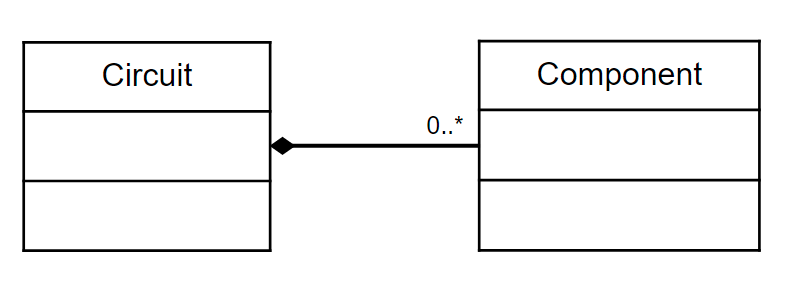
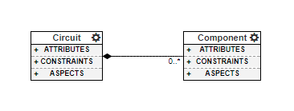

What is Meta-modeling?
======================
Alright, so you have created your first webgme project and probably want to make a bit more interesting than just containing
the **FCO** and **ROOT** nodes...

In a typical modeling environment (including the Design Studio you will have built up at the end of this tutorial)
there will be a syntax or schema for how models can be constructed. In many tools this syntax is implied and enforced by the source code itself.
But webgme, and meta-modeling tools in general, work differently. The rules for how models can be composed (structural semantics)
is captured in a model itself - the meta-model.

The following definition of meta-modeling is borrowed from Wikipedia [1]_.

::

    A metamodel or surrogate model is a model of a model, and metamodeling
    is the process of generating such metamodels.

So a meta-model is a model that governs how other models can be composed.

Simple Containment Example
-------------------------
The domain, or meta-model, we are targeting in this tutorial is a domain for building electrical circuits. Two obvious
concepts that comes into mind are the notions of a :code:`Circuit` and a :code:`Component`.

* :code:`Circuit` - A diagram where different types of electrical-components will be place and wired together.
* :code:`Component` - An abstract base type for various electrical-components such as :code:`Resistor`, :code:`Ground`, :code:`Inductor`, etc.

Conceptually, just the notion of these two meta-types constitutes a meta-model. So far we have declared that our models can
have instances of :code:`Circuit` and :code:`Component`, however nothing has been said about how such instances can be related to one another...

A natural way of relating electrical-circuits and electrical-components is to say that circuits *can contain* components. Most meta-modeling
environments have the notion of **containment** that defines exactly this. (It is typically visualized as an edge between the two types, where
the end at the container is a black diamond.)

    Containment as depicted in `UML <https://en.wikipedia.org/wiki/Unified_Modeling_Language>`_

    Containment as depicted in WebGME

In the two graphical representations of **containment** the **cardinality** is also shown. For this example it says that
there can be any number of :code:`Components` contained inside of a :code:`Circuit`.

**Containment** is also a strong relationship. This means that when the parent (the container) is removed from the model
so are the children. This suites well for electrical-circuits - if we discard a circuit the components are discarded as well.

Model elements can be related in more ways than **containment**, in the next sections we will go through all the different
meta concepts, meta rules, that webgme support. At this point you just need to have an idea of what meta-modeling is.

.. [1] This tutorial uses the hyphenated version of meta-model and not metamodel.